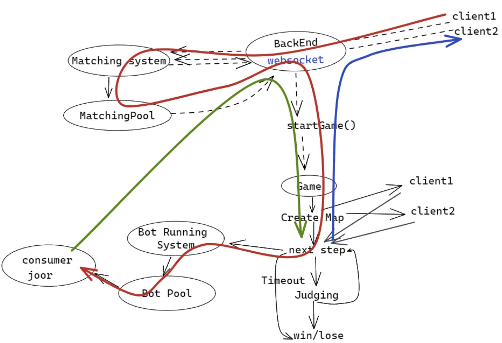

<h1 align="center">King of Bots</h1>

<p align="center">


</p>


<h2 align="center"><a  href="https://www.youtube.com/playlist?list=PL19gLLZg9Yeb85zlQYu9QcgE1Ssb1s6tu">View Demos</a></h2>

## Description

<p align="center"></p>

Implemented a real-time battle platform from scratch, which also features game replay, rankings and more. 

Realized eight web pages with Vue and Vuex, implemented three microservices based on Spring Boot and Spring Cloud, and used Spring Security, JSON Web Token (JWT) and WebSocket to enhance the security and scalability of the platform.

**This project is inspired by [Snake (video game genre)](https://en.wikipedia.org/wiki/Snake_(video_game_genre))**.

## How to play

### Game Overview

- This game is a two-player turn-based game. Your character in the game is a snake. You can control the direction of the snake yourself or write Java code to play for you.
- Once the game starts, as your snake moves, it will gradually get longer. All you have to do is control your snake to avoid the obstacles. Please note that if your snake head hits your body or your opponent's snake, you will also lose the game.

### Quickstart Rules
- Before you start the game, please register and log in.
  <p align="center"></p>

- Before starting a match, select the Bot that will play for you in the drop-down menu. If you do not make a selection, you will control the snake's movement yourself by default.
   <p align="center"></p>

- When the game starts, you will be born in the map's lower left or upper right corner, and the text below the map will indicate your birth location.
    <p align="center"></p>

- If you choose to fight in person, please focus on the game map and use the keyboard to control the direction of your snake by typing w(up), d(right), s(down), and a(left).
  **View a [demo](https://youtu.be/IPBByE7_3FE) of Player vs. Player**.
   
- If you choose Bot to play, you will no longer be able to control the direction of the snake's movement via the keyboard.
  **View [demos](https://youtube.com/playlist?list=PL19gLLZg9Yeb85zlQYu9QcgE1Ssb1s6tu) of Bot vs. Player and Bot vs. Bot**.

- Once you join the game, the first round begins immediately. After both you and your opponent give instructions for the snake's next step, both snakes move one block in the designated direction simultaneously and then move on to the next turn.


## About the project

### Modules for this project

- **PK(one versus one)**
  - **Matching page** (MatchingSystem microservice achieve matching)
  - **Bot vs. Bot** （WebSocket）
    - Front-end simulates the process of a two-Bot match.
  - **Player vs. Bot** or **Player vs. Player**（WebSocket）
    - Players control the direction of the snake by keyboard.
  - **Dynamically compile and execute Bot code** (BotRunningSystem microservice achieve this)
  <p align="center"></p>

- **Matchup List**
  - **Matchup list page**
    - Each time a game is finished, add it to the matchup list.
  - **Game replay page**
    - Select any game from the reverse chronological game list to view the game replay.
  <p align="center"></p>

- **Rankings**
  - Each player has the same rating (1500) when registering, with five points added for a winning game and two points subtracted for a losing game. 
  - Players with close ratings will be more likely to be matched together to start a game.
  <p align="center"></p>

- **User Center**
  - Registration
  - Login
  - My bot list
  - Create or modify a bot
  <p align="center"></p>
  <p align="center"></p>


### Game Parameter

- The **map** is a **13*14** grid consisting of grass and obstacles.
  - **Walls** surround the map's interior, with **twenty obstacle squares** distributed within the walls.
  - Used the flood-fill algorithm to ensure the **connectivity** of the adaptive scaling map with **centrosymmetric randomly distributed obstacles** to keep game fairness.
    - The lower left and upper right corners are connectable.
  <p align="center"></p>

- The maximum **duration of a turn** is **five seconds**.
- The **snake** will increase in length by **one per turn for the first ten rounds** and by **one every three rounds starting on turn eleven**.

### In these cases, you will lose the game.

- Within the time limit of one turn (5 seconds), if you do not enter the direction of your snake's next move via the keyboard or if your Bot code does not output a result.
- Your snake's head hits its body or your opponent's snake.
- Your snake's head hits an obstacle in the map or walls around the map.

## You can write your Bot code like this.

- The snake can move in four directions, and in your program, you can use these four numbers to indicate the direction the snake will move next, as shown in the following table.
    | Direction | Keystrokes | Numbers |
    | :-------: | :--------: | :-----: |
    |    Up     |     w      |    0    |
    |   Right   |     d      |    1    |
    |   Down    |     s      |    2    |
    |   Left    |     a      |    3    |

### The Bot that only goes down
- The following code is a bot that only goes down. You need to write the nextMove() method, and you can get a Bot of your own.
  
    ```java
    package com.kob.botrunningsystem.utils;

    import java.io.File;
    import java.io.FileNotFoundException;
    import java.util.Scanner;

    public class Bot implements java.util.function.Supplier<Integer> {
        public Integer nextMove(String input) {
            return 2;  // a bot that only goes down
        }

        @Override
        public Integer get() {
            File file = new File("input.txt");
            try {
                Scanner sc = new Scanner(file);
                return nextMove(sc.next());
            } catch (FileNotFoundException e) {
                throw new RuntimeException(e);
            }
        }
    }
    ```

### The Bot that only judges one step
- This program implements a Bot that can determine in advance whether there is an obstacle in the next step and then select the appropriate direction of advance. You can develop your Bot program based on this template.
- Currently implemented to compile and run Java code dynamically, so please use Java code to develop your Bot.
  
    ```java
    package com.kob.botrunningsystem.utils;

    import java.io.File;
    import java.io.FileNotFoundException;
    import java.util.ArrayList;
    import java.util.List;
    import java.util.Scanner;

    public class Bot implements java.util.function.Supplier<Integer> {

            // Units that make up the snake's body.
        static class Cell {
            public int x, y;
            public Cell(int x, int y) {
                this.x = x;
                this.y = y;
            }
        }

            // Determines if the snake will grow longer in the STEP round.
        private boolean check_tail_increasing(int step) {
            if (step <= 10) return true;
            return step % 3 == 1;
        }

            // Get the current snake body position.
        public List<Cell> getCells(int sx, int sy, String steps) {
            steps = steps.substring(1, steps.length() - 1);
            List<Cell> res = new ArrayList<>();

            int[] dx = {-1, 0 ,1, 0}, dy = {0, 1, 0, -1};

            int x = sx, y = sy;
            int step = 0;

            res.add(new Cell(x, y));

            for (int i = 0; i < steps.length(); i ++ ) {
                int d = steps.charAt(i) - '0';
                x += dx[d];
                y += dy[d];
                res.add(new Cell(x, y));
                if (!check_tail_increasing( ++ step)) {
                    res.remove(0);
                }
            }
            return res;
        }

            // The code you need to write.
        public Integer nextMove(String input) {
            String[] strs = input.split("#");
            int[][] g = new int[13][14];
            for(int i = 0, k = 0; i < 13; i++) {
                for (int j = 0; j < 14; j++, k++) {
                    if (strs[0].charAt(k) == '1') {
                        g[i][j] = 1;  // The g array records the obstacles on the map.
                    }
                }
            }

            int aSx = Integer.parseInt(strs[1]), aSy = Integer.parseInt(strs[2]); // Get the initial position of the two snakes.
            int bSx = Integer.parseInt(strs[4]), bSy = Integer.parseInt(strs[5]);

            List<Cell> aCells = getCells(aSx, aSy, strs[3]);
            List<Cell> bCells = getCells(bSx, bSy, strs[6]);


            // Record the coordinates of the two snake bodies in the map as obstacles.
            for (Cell c : aCells) g[c.x][c.y] = 1;
            for (Cell c : bCells) g[c.x][c.y] = 1;


            // Select a legal direction to advance one step.
            int[] dx = {-1, 0 ,1, 0}, dy = {0, 1, 0, -1}; 
            for (int i = 0; i < 4; i ++ ) {
                int x = aCells.get(aCells.size() - 1).x + dx[i];
                int y = aCells.get(bCells.size() - 1).y + dy[i];
                if (x >= 0 && x < 13 && y >= 0 && y < 14 && g[x][y] == 0) {
                    return i;
                }
            }

            return 0;
        }

        @Override
        public Integer get() {
            File file = new File("input.txt");
            try {
                Scanner sc = new Scanner(file);
                return nextMove(sc.next());
            } catch (FileNotFoundException e) {
                throw new RuntimeException(e);
            }
        }
    }
    ```

- The input.txt file in the above code stores information about the current game, including map information, the initial positions of the two players and their direction operations.
    ```java
    getMapString() + "#" +
    me.getSx() + "#" +
    me.getSy() + "#(" +
    me.getStepsString() + ")#" +
    you.getSx() + "#" +
    you.getSy() + "#(" +
    you.getStepsString() + ")";
    ```

## Communication process diagram

<p align="center"></p>

## Q & A

### I cannot open the [project link](https://app3779.acapp.acwing.com.cn). 
  - Probably because I have closed the backend of the platform, please email me and I will open it. 
    - <ruijia17@gmail.com>
  
### I cannot match my opponent.
- Right now, the game has few players, and no players are online at the same time as you. Suppose you don't want to keep waiting. You can open the [project link](https://app3779.acapp.acwing.com.cn) using another browser or the current browser's incognito mode to operate two players to match and play against each other.

## Future scope

- Create a good-looking homepage.
- Implement another battle mode.
  - It gives users the option to select whether to match with a live player or play against an already set Bot.
  - Provide different intelligent levels of Bots for players to choose from.
  - This makes it easy for players to start a game immediately and test the Bot they have created.
